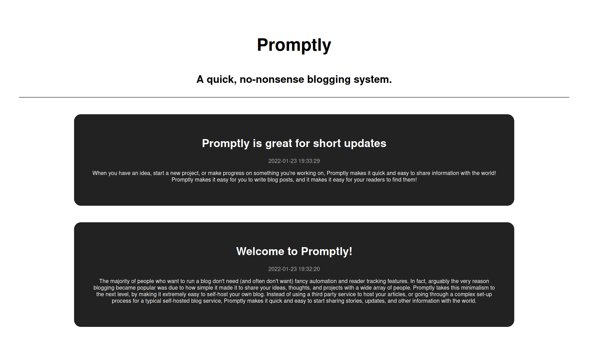

# Promptly
A simple, no-nonsense, self-hosted blogging platform.

## Description

The majority of people who want to run a blog don't need (and often don't want) fancy automation and reader tracking features. In fact, arguably the very reason blogging became popular was due to how simple it made it to share your ideas, thoughts, and projects with a wide array of people. Promptly takes this minimalism to the next level, by making it extremely easy to self-host your own blog. Instead of using a third party service to host your articles, or going through a complex set-up process for a typical self-hosted blog service, Promptly makes it quick and easy to start sharing stories, updates, and other information with the world.

## Disclaimer

While Promptly works great as a simple blogging platform, or as a starting point for developers to build more complex platforms, it's intentionally simple and non-complex. If you're looking for a feature rich blogging system, Promptly may not be for you.

## Screenshots

## Features

### Simple

The main benefit to Promptly is it's unbelievable simplicity. It contains only what you need to get started with blogging, and absolutely nothing more. This makes it a great starting platform for building your own website from the ground up.

### Lightweight

As you might imagine from it's simplicity, Promptly is unbelievably lightweight. While still being visually appealing and modern looking, each page barely uses any network resources at all, meaning the entire website feels extremely snappy and responsive.

### Accessible

The simple design of Promptly makes in inherently accessible. All of the webpages are clearly laid out, easy to understand, and easy to read, even with visual impairments. Promptly is also very screen-reader friendly.
